# Provider Failure / Graceful Degradation Sequence Diagram — Personal Music Discovery Engine

## Purpose

This sequence diagram describes how the Personal Music Discovery Engine should behave when one or more dependencies fail or degrade during query execution.

This document focuses on graceful degradation for the following failure classes:

1. one external music provider fails,
2. Gemini interpretation or explanation is rate-limited or unavailable,
3. cached evidence is available and can be reused,
4. cached evidence is unavailable and confidence must be downgraded,
5. clarification is preferable to hard failure,
6. local inventory refresh may fall back to a still-valid cached snapshot.

This version remains aligned with the current architecture assumptions:

- **Gemini 2.5 Pro** via the **Gemini Developer API free tier** is used for interpretation and explanation,
- **MusicBrainz**, **Last.fm**, and **Discogs** are used for world-knowledge retrieval,
- **Clementine** remains the local inventory authority,
- and the cache layer is a first-class resilience mechanism.

---

## Failure Modes Covered

### FM-1 — One external provider fails
A provider times out, returns an error, or returns unusable data.

### FM-2 — Gemini interpretation call fails
Gemini returns a rate-limit error or temporary service failure during intent interpretation.

### FM-3 — Gemini explanation call fails
Gemini returns a rate-limit error or temporary service failure during explanation generation.

### FM-4 — Cached provider evidence exists
The system can reuse previously stored provider evidence packets.

### FM-5 — Cached provider evidence does not exist
The system must proceed with partial provider evidence or lower confidence.

### FM-6 — Local inventory refresh fails but a fresh-enough snapshot exists
The system can continue only if local scope can still be guaranteed.

---

## Main Graceful Degradation Sequence Diagram

```mermaid
sequenceDiagram
    autonumber

    actor User
    participant UI as Chat UI
    participant Intake as Request Intake Service
    participant Session as Session Context Service
    participant Intent as Intent Interpretation Service
    participant Gemini as Gemini Gateway (Gemini 2.5 Pro)
    participant Retrieve as External Retrieval Orchestrator
    participant MB as MusicBrainz Adapter
    participant LF as Last.fm Adapter
    participant DG as Discogs Adapter
    participant Graph as World Candidate Graph Builder
    participant Local as Local Collection Adapter (Clementine)
    participant Ground as Grounding Engine
    participant Rank as Ranking Engine
    participant Explain as Explanation Service
    participant Clarify as Clarification Decision Service
    participant Compose as Response Composer
    participant Cache as Cache Layer
    participant Obs as Observability / Diagnostics

    User->>UI: Submit music request
    UI->>Intake: Create request envelope
    Intake->>Session: Load session context
    Session-->>Intake: Context summary + constraints
    Intake->>Obs: Log request received

    Intake->>Cache: Check cached intent profile
    alt Cached intent profile exists
        Cache-->>Intent: Cached intent profile
        Intent->>Obs: Log cached interpretation reuse
    else No cached intent profile
        Intake->>Intent: Interpret request
        Intent->>Gemini: Send interpretation prompt
        alt Gemini interpretation succeeds
            Gemini-->>Intent: Intent Profile
            Intent->>Cache: Store intent profile
        else Gemini interpretation fails / rate-limited
            Gemini-->>Intent: Error / quota failure
            Intent->>Cache: Check prior compatible intent profile
            alt Compatible cached interpretation exists
                Cache-->>Intent: Cached intent profile fallback
                Intent->>Obs: Log AI fallback interpretation reuse
            else No cached interpretation fallback
                Intent-->>Compose: Interpretation degraded / unavailable
                Compose-->>UI: Return temporary failure or narrow fallback response
                UI-->>User: Show degradation message
            end
        end
    end

    alt Interpretation available
        Intent-->>Retrieve: Intent Profile
        Intent-->>Rank: Intent Profile
        Intent-->>Explain: Intent Profile

        Retrieve->>Cache: Check cached provider evidence packets
        alt Cached provider evidence exists
            Cache-->>Retrieve: External evidence packets
            Retrieve->>Obs: Log cached provider evidence reuse
        else No cached provider evidence
            par Query MusicBrainz
                Retrieve->>MB: Provider-specific retrieval request
                alt MusicBrainz succeeds
                    MB-->>Retrieve: Evidence Packet
                else MusicBrainz fails
                    MB-->>Retrieve: Provider error
                    Retrieve->>Cache: Check cached MusicBrainz packet
                    alt Cached MusicBrainz packet exists
                        Cache-->>Retrieve: Cached MusicBrainz packet
                    else No cached MusicBrainz packet
                        Retrieve->>Obs: Log partial provider failure
                    end
                end
            and Query Last.fm
                Retrieve->>LF: Provider-specific retrieval request
                alt Last.fm succeeds
                    LF-->>Retrieve: Evidence Packet
                else Last.fm fails
                    LF-->>Retrieve: Provider error
                    Retrieve->>Cache: Check cached Last.fm packet
                    alt Cached Last.fm packet exists
                        Cache-->>Retrieve: Cached Last.fm packet
                    else No cached Last.fm packet
                        Retrieve->>Obs: Log partial provider failure
                    end
                end
            and Query Discogs
                Retrieve->>DG: Provider-specific retrieval request
                alt Discogs succeeds
                    DG-->>Retrieve: Evidence Packet
                else Discogs fails
                    DG-->>Retrieve: Provider error
                    Retrieve->>Cache: Check cached Discogs packet
                    alt Cached Discogs packet exists
                        Cache-->>Retrieve: Cached Discogs packet
                    else No cached Discogs packet
                        Retrieve->>Obs: Log partial provider failure
                    end
                end
            end
            Retrieve->>Cache: Store any newly successful provider packets
        end

        Retrieve->>Graph: Build world candidate graph from available evidence
        Graph-->>Ground: World Candidate Graph
        Graph-->>Clarify: Graph ambiguity signals
        Graph->>Obs: Log graph quality and provider completeness

        Intake->>Local: Request local inventory snapshot
        Local->>Cache: Check cached inventory snapshot
        alt Fresh local inventory snapshot available in cache
            Cache-->>Local: Local Inventory Snapshot
        else No cached snapshot
            alt Local refresh succeeds
                Local-->>Ground: Local Inventory Snapshot
                Local->>Cache: Store inventory snapshot
            else Local refresh fails
                Local->>Cache: Check last valid inventory snapshot
                alt Last valid snapshot still allowed by freshness policy
                    Cache-->>Local: Cached inventory snapshot fallback
                    Local->>Obs: Log cached inventory fallback
                else No valid local snapshot
                    Local-->>Compose: Local inventory unavailable
                    Compose-->>UI: Return hard failure (cannot guarantee local ownership)
                    UI-->>User: Show local inventory unavailable message
                end
            end
        end

        alt Local inventory available
            Local-->>Ground: Local Inventory Snapshot
            Ground->>Ground: Exact / fuzzy / semantic grounding
            Ground-->>Rank: Grounded Local Candidate Set
            Ground->>Obs: Log grounding completeness

            Rank->>Rank: Score available candidates
            Rank->>Rank: Downweight weakly supported / weakly grounded items
            Rank-->>Clarify: Recommendation confidence spread
            Rank-->>Explain: Recommendation Set
            Rank-->>Compose: Recommendation Set
            Rank->>Obs: Log ranking confidence

            Clarify->>Clarify: Evaluate ambiguity threshold
            alt Clarification is preferred
                Clarify-->>Compose: Clarification Request
                Compose-->>UI: Ask one clarifying question
                UI-->>User: Show clarification prompt
            else Direct recommendation response is acceptable
                Explain->>Cache: Check cached explanation payload
                alt Cached explanation payload exists
                    Cache-->>Explain: Explanation Payload
                else No cached explanation
                    Explain->>Gemini: Generate explanation
                    alt Gemini explanation succeeds
                        Gemini-->>Explain: Explanation Payload
                        Explain->>Cache: Store explanation payload
                    else Gemini explanation fails / rate-limited
                        Gemini-->>Explain: Error / quota failure
                        Explain->>Cache: Check cached explanation payload
                        alt Cached explanation exists
                            Cache-->>Explain: Cached explanation payload fallback
                        else No cached explanation available
                            Explain-->>Compose: Minimal explanation mode
                        end
                    end
                end

                alt Full explanation payload available
                    Explain-->>Compose: Explanation Payload
                    Compose->>Compose: Build normal response
                else Minimal explanation mode
                    Compose->>Compose: Build reduced-confidence response with short rationale only
                end

                Compose-->>UI: Recommendations + explanation or reduced explanation
                UI-->>User: Show degraded-but-usable result
            end
        end
    end
```

---

## Failure-Handling Policy by Stage

## 1. Request Intake and Session Context

### Failure posture
This stage should almost never fail unless the application itself is unhealthy.

### Graceful behavior
- preserve the raw user prompt,
- attempt to continue even if optional session enrichment is missing,
- log missing context but do not fail the request solely because prior session state is unavailable.

---

## 2. Intent Interpretation Failure

### Preferred fallback order
1. cached compatible intent profile
2. narrower fallback interpretation mode (optional future path)
3. temporary failure message

### Policy
The system should not proceed to world retrieval if it has no trustworthy interpretation anchor.

### User-facing outcome
If no intent can be recovered:
- fail early,
- be explicit,
- do not fabricate an interpretation.

---

## 3. Provider Retrieval Failure

### Preferred fallback order
1. fresh live response
2. cached provider packet
3. partial provider set with downgraded confidence
4. clarification if ambiguity becomes too high

### Policy
One provider failing should **not** cause total request failure if:
- at least some external evidence remains,
- and the remaining evidence is sufficient to build a usable world graph.

### User-facing outcome
The user should still receive recommendations where possible, but confidence may be lower and explanations should avoid overstating certainty.

---

## 4. World Candidate Graph with Partial Evidence

### Policy
The graph builder must support:
- partial provider evidence,
- support counts,
- weak-support flags,
- and graph-summary quality markers.

### Ranking implication
Items supported by fewer providers or weaker graph consensus should receive lower evidence-strength contributions.

---

## 5. Local Inventory Failure

### Preferred fallback order
1. fresh local inventory snapshot
2. cached inventory snapshot that still satisfies freshness policy
3. hard stop

### Policy
Because final recommendations must remain constrained to local ownership, the system should not continue if it cannot guarantee local scope.

### User-facing outcome
If no valid local snapshot exists, the system should return a clear failure rather than recommending unverified items.

---

## 6. Grounding Failure or Weak Grounding

### Policy
If grounding is weak but not impossible:
- continue with explicit low-confidence candidates,
- favor clarification when top candidates diverge stylistically,
- avoid pretending semantic-neighbour substitutes are exact matches.

### User-facing outcome
Return the best local equivalents with confidence-aware explanation.

---

## 7. Explanation Failure

### Preferred fallback order
1. cached explanation payload
2. reduced explanation mode built from ranking rationale fragments
3. recommendations without full curator narrative, but with minimal transparent justification

### Policy
The system should prefer giving a reduced but honest result over a total failure if recommendations are already ranked.

### User-facing outcome
Examples of reduced explanation mode:
- “These are the strongest local matches I could identify, but the explanation layer is temporarily limited.”
- per-item short rationale from stored ranking fragments only.

---

## 8. Clarification as a Graceful Degradation Tool

Clarification is not only for semantic ambiguity.
It is also a useful graceful-degradation mechanism when:
- provider evidence is partial,
- the world graph is weak,
- or exact and semantic-substitute paths diverge.

### Policy
If a single high-value clarification could rescue recommendation quality, ask it instead of forcing a weak answer.

---

## Reduced Confidence Response Pattern

When the system must degrade but can still answer, the response should communicate:

1. that the result set is still local-only,
2. that the outside-world evidence was partial or weaker than usual,
3. and that the recommendations are the best available matches under degraded conditions.

### Example pattern

> “I found some good matches from your local collection, but the supporting external evidence is weaker than usual right now. These results are still grounded to your library, but I’d treat them as medium-confidence recommendations.”

---

## Observability Requirements for Failure Paths

The diagnostics layer should capture at minimum:

- request ID
- failed stage
- provider name if relevant
- cache hit / miss for fallback attempt
- whether degraded response was returned
- whether clarification was chosen instead of direct answer
- confidence downgrade reason
- local inventory freshness state

This is required for:
- debugging,
- benchmark analysis,
- and future reliability tuning.

---

## Suggested Follow-On Diagram Variants

After this failure-aware sequence diagram, the most useful related diagrams would be:

1. **Gemini-only degradation diagram**
   - interpretation failure
   - explanation failure
   - cached AI artifact reuse

2. **Provider partial-consensus graph diagram**
   - one provider missing
   - graph still built with support weights

3. **Clarification loop degradation diagram**
   - weak graph
   - clarification request
   - rerun from updated intent profile

4. **Inventory-staleness decision diagram**
   - when cached inventory is still acceptable
   - when hard failure is required

---

## Suggested Filename

`docs/architecture/provider-failure-graceful-degradation-sequence-diagram.md`

---

## Executive Summary

The system should not behave as if every dependency is always available.

The current architecture depends on:
- Gemini 2.5 Pro on the free tier,
- multiple external music providers,
- and a Clementine-backed local inventory.

That means graceful degradation must be an explicit behavior, not an afterthought.

The preferred degradation hierarchy is:

1. reuse cached artifacts where valid,
2. continue with partial provider evidence where safe,
3. lower confidence honestly,
4. ask one clarifying question when that materially improves quality,
5. and only fail hard when local ownership scope can no longer be guaranteed.

This sequence diagram makes the operational behavior of the system realistic and keeps trust intact even when upstream dependencies are imperfect.
