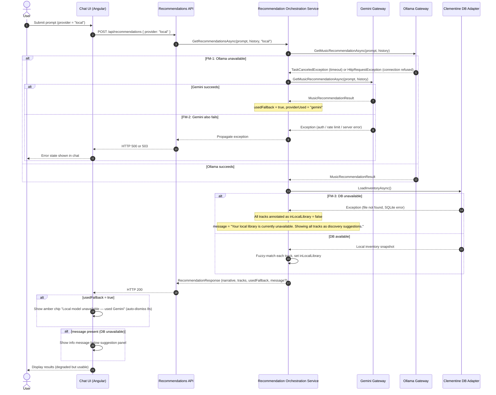
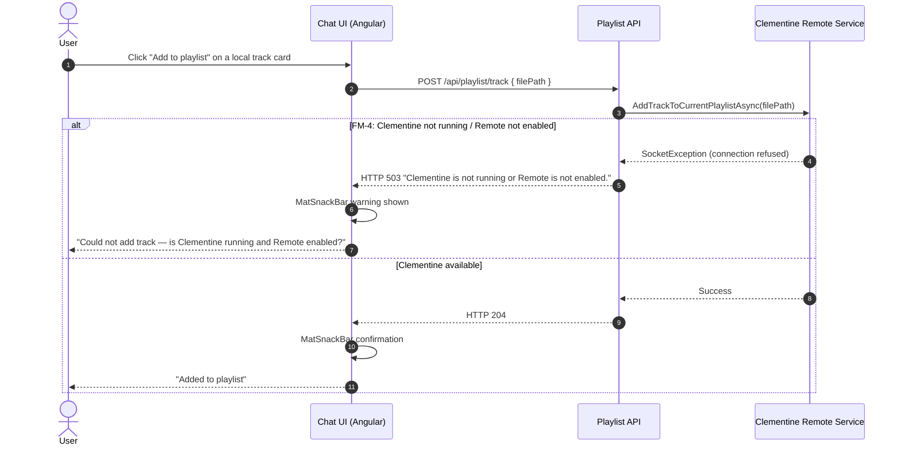

# Provider Failure / Graceful Degradation Sequence Diagram — Personal Music Discovery Engine

## Purpose

This sequence diagram describes how the Personal Music Discovery Engine behaves when dependencies fail or degrade during request execution.

This document covers the following failure classes in the current architecture:

1. Ollama (local LLM) is unavailable — fallback to Gemini
2. Gemini is unavailable or returns an error
3. Clementine DB copy is missing or unreadable
4. Clementine Remote is unavailable (Phase 4)

---

## Failure Modes Covered

### FM-1 — Ollama unavailable (timeout or connection refused)
User selected "local" provider but Ollama is not running, or CPU inference exceeded the 5-minute timeout.

### FM-2 — Gemini unavailable or returns an error
The Gemini API returns a rate-limit, auth, or server error.

### FM-3 — Clementine DB copy unreadable
The configured DB copy path is wrong, the file is missing, or the SQLite read fails.

### FM-4 — Clementine Remote unavailable (Phase 4)
The user clicks "Add to playlist" or "Build playlist" but Clementine is not running or Remote is not enabled.

---

## Main Graceful Degradation Sequence

---

## Phase 4 Failure Diagram — Clementine Remote

---

## Failure-Handling Policy by Component

## 1. Ollama Gateway

### Failure posture
Ollama is optional. Its unavailability must never hard-fail the user's request.

### Graceful behavior
- Catch `TaskCanceledException` (inference timeout, 5 min) and `HttpRequestException` with `StatusCode is null` (connection refused).
- Fall back to Gemini automatically.
- Set `usedFallback = true` and `providerUsed = "gemini"` on the response.

### User-facing outcome
The response arrives normally. An amber chip informs the user that Gemini was used instead of the local model.

---

## 2. Gemini Gateway

### Failure posture
Gemini is the primary and fallback LLM. Its failure should surface as a visible error, not a silent empty response.

### Graceful behavior
- Propagate the exception to the controller.
- Return an appropriate HTTP error code (500 or 503).
- Do not return a partial or fabricated narrative.

### User-facing outcome
The chat shows an error state with a retry affordance.

---

## 3. Clementine DB Adapter

### Failure posture
The local library is best-effort. Its unavailability should degrade to a discovery-only view, not a hard failure.

### Graceful behavior
- Catch all exceptions from SQLite access.
- Annotate all tracks as `inLocalLibrary = false`.
- Set `message` to inform the user that local filtering is unavailable.
- Return all tracks as discovery (magenta) so the user still gets recommendations.

### User-facing outcome
All tracks are shown as magenta discovery cards. A message explains that the local library is temporarily unavailable.

---

## 4. Clementine Remote Service (Phase 4)

### Failure posture
Playlist operations are interactive actions. Failure must be immediately visible to the user.

### Graceful behavior
- Catch `SocketException` (connection refused on port 5501).
- Return HTTP 503 with a human-readable message.
- Do not retry silently.

### User-facing outcome
A `MatSnackBar` warning tells the user that Clementine is not running or Remote is not enabled.

---

## Summary of Degradation Outcomes

| Failure | Outcome | User sees |
|---|---|---|
| Ollama timeout / unavailable | Falls back to Gemini | Amber chip, response still arrives |
| Gemini error | Hard error | Error state in chat, retry affordance |
| Clementine DB unavailable | All tracks shown as discovery | Info message, magenta cards only |
| Clementine Remote unavailable | 503 response | Snackbar warning on playlist action |
