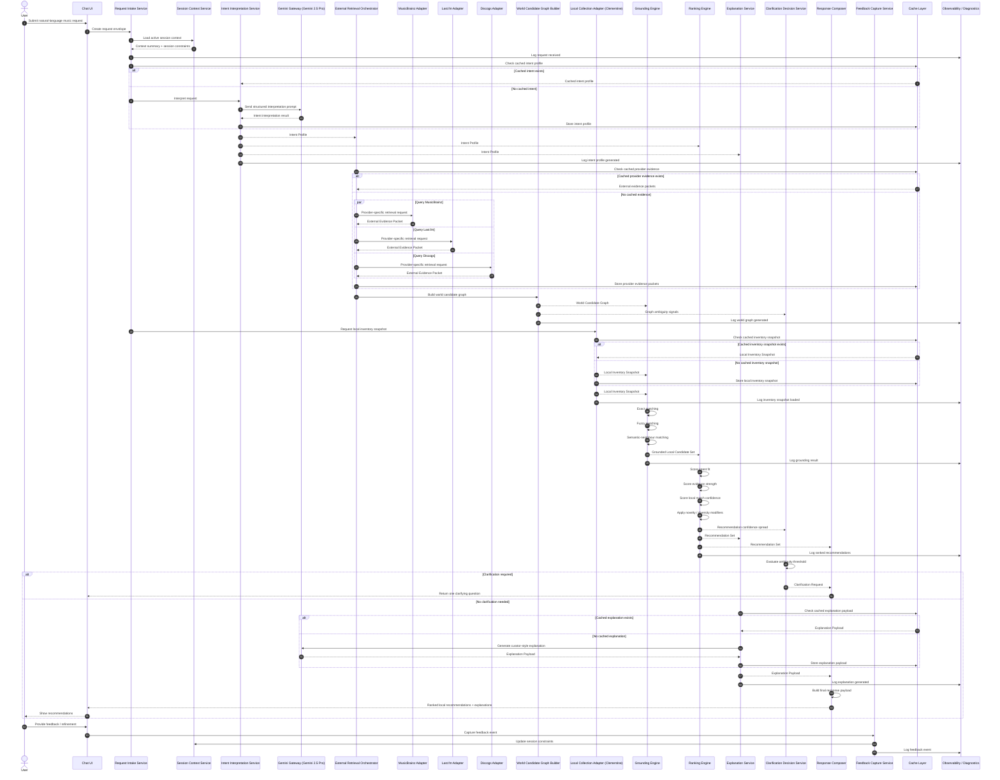

# Query Execution Sequence Diagram — Personal Music Discovery Engine

## Purpose

This sequence diagram shows the end-to-end execution flow for a single music recommendation request in the current architecture.

This version assumes:

- **Gemini 2.5 Pro** via the **Gemini Developer API free tier** is used for:
  - intent interpretation,
  - structured intent generation,
  - and explanation generation.
- **MusicBrainz**, **Last.fm**, and **Discogs** are used for external music evidence retrieval.
- **Clementine** remains the local inventory authority.

---

## Sequence Diagram

---

## Step-by-Step Flow Summary

### 1. Request intake
The user submits a natural-language music prompt through the chat UI.
The system creates a **Request Envelope**, loads session context, and records the request for traceability.

### 2. Intent interpretation
The request is converted into a structured **Intent Profile** using the **Intent Interpretation Service**, which calls the **Gemini Gateway** to use **Gemini 2.5 Pro** for prompt understanding.

### 3. External evidence retrieval
The **External Retrieval Orchestrator** fans out to:
- MusicBrainz,
- Last.fm,
- Discogs

Each adapter returns an **External Evidence Packet**.

### 4. World candidate graph construction
The **World Candidate Graph Builder** merges all provider packets into one normalized graph representing the “outside-world meaning” of the request.

### 5. Local inventory retrieval
The **Local Collection Adapter** queries the **Clementine** collection and produces a **Local Inventory Snapshot**.

### 6. Grounding / crosswalk
The **Grounding Engine** maps the world graph to the local inventory using:
- exact matches,
- fuzzy matches,
- semantic-neighbour matches.

### 7. Ranking
The **Ranking Engine** produces a **Recommendation Set** using:
- intent fit,
- evidence strength,
- local confidence,
- novelty / recency,
- diversity controls.

### 8. Clarification decision
If ambiguity is too high, the **Clarification Decision Service** emits one focused **Clarification Request**.

### 9. Explanation generation
If clarification is not needed, the **Explanation Service** calls **Gemini 2.5 Pro** to produce a curator-style **Explanation Payload**.

### 10. Response composition
The **Response Composer** assembles the final response:
- ranked recommendations,
- explanations,
- optional refinement prompts.

### 11. Feedback capture
User feedback is captured and converted into a **Feedback Event**, which updates session context for later turns.

---

## Why This Sequence Matches the Current Architecture

### Gemini is used where it is strongest in this version
Gemini 2.5 Pro is used for:
- intent interpretation,
- and explanation generation,

but not for world retrieval.

### External music retrieval remains provider-based
Because free-tier Gemini 2.5 Pro does not provide free grounding with Google Search / Maps, the architecture keeps world retrieval in dedicated adapters:
- MusicBrainz,
- Last.fm,
- Discogs.

### Local ownership remains authoritative
The system does not recommend from the internet.
It recommends only from the **Clementine-backed local inventory** after the world graph has been grounded locally.

### Cache and observability are first-class participants
Both are shown directly in the diagram because:
- free-tier AI/API usage can be rate-limited,
- external provider calls are operationally variable,
- and traceability is essential for debugging and explanation.

---

## Suggested Follow-On Diagram Variants

After this sequence diagram, the most useful variants would be:

1. **happy-path only sequence diagram**
   - no ambiguity branch
   - no provider failure branch

2. **provider failure / graceful degradation sequence diagram**
   - one external provider unavailable
   - cached world evidence fallback

3. **clarification loop sequence diagram**
   - user clarifies
   - pipeline reruns from intent interpretation or ranking

4. **feedback refinement sequence diagram**
   - “more like this”
   - session modifier update
   - rerank-only path

---

## Suggested Filename

`docs/architecture/query-execution-sequence-diagram.md`
