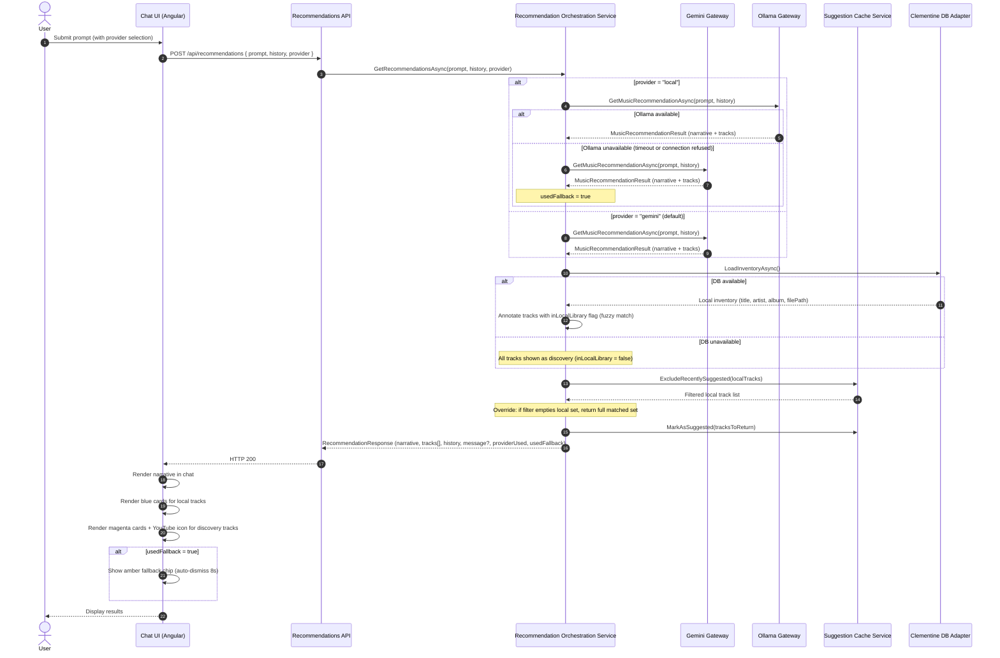

# Query Execution Sequence Diagram — Personal Music Discovery Engine

## Purpose

This sequence diagram shows the end-to-end execution flow for a single music recommendation request in the current architecture.

This version reflects the current implementation:

- The user optionally selects a **provider** (Gemini or local Ollama model) via a toggle in the UI.
- The selected LLM gateway returns a conversational narrative + structured track list in a single call.
- Tracks are annotated against the **Clementine local inventory** using normalised fuzzy matching.
- A **suggestion cache** avoids repeating the same local tracks within a configurable time window.
- The response returns all tracks tagged with `inLocalLibrary` — local tracks (blue) and discovery tracks (magenta).

---

## Sequence Diagram



---

## Provider Routing Logic

### Gemini (default)
- Called directly when `provider = "gemini"` or no provider specified.
- Uses `GeminiGatewayService` with the Gemini Developer API.
- Model configured via `GEMINI_MODEL` (default `gemini-2.5-flash`).

### Ollama (local)
- Called when `provider = "local"`.
- Uses `OllamaGatewayService` with Ollama's OpenAI-compatible `/v1/chat/completions` endpoint.
- Model configured via `OLLAMA_MODEL` (default `llama3.1:8b`).
- Timeout: 5 minutes (CPU inference can take 60–120 seconds).
- Falls back to Gemini automatically on timeout or connection refused.

---

## Local Library Annotation

The `ClementineService` reads from a **copy** of the Clementine SQLite database at the path configured by `CLEMENTINE_DB_PATH`. It is not the live database.

Each Gemini/Ollama track suggestion is compared against the local inventory using:
- normalised artist + title (lowercase, punctuation stripped, whitespace collapsed)
- similarity threshold configurable via `CLEMENTINE_MATCH_THRESHOLD` (default `0.75`)
- album used as an optional tiebreaker

The result is an `inLocalLibrary` flag on each `TrackSuggestion`. Nothing is hidden — all tracks are returned.

---

## Suggestion Cache

The `SuggestionCacheService` (singleton, in-memory) tracks which local tracks have been returned to the user within the configured window (`RECOMMENDATION_SUGGESTION_CACHE_MINUTES`, default 60 minutes).

- Cache applies **only to local tracks** (`inLocalLibrary = true`).
- Discovery tracks are never cached.
- Override rule: if the cache would produce an empty local set, the full matched set is returned regardless.

---

## Response Contract

```
RecommendationResponse {
  narrative:     string            // Gemini/Ollama conversational response
  tracks:        TrackSuggestion[] // all tracks, annotated with inLocalLibrary + filePath
  history:       ConversationTurn[]
  message?:      string            // set when DB is unavailable or no tracks found
  providerUsed:  "gemini" | "local"
  usedFallback:  bool
}

TrackSuggestion {
  title:         string
  artist:        string
  album?:        string
  inLocalLibrary: bool
  filePath?:     string  // non-null for local tracks; null for discovery tracks
}
```
